SARIMA
================

Ejercicio de Simulación
-----------------------

Vamos a hacer un ejercicio de simulación para ver como se identifica la
compoente estacional.

``` r
library(urca)
library(forecast)
```

    ## Registered S3 method overwritten by 'quantmod':
    ##   method            from
    ##   as.zoo.data.frame zoo

``` r
library(tseries)
library(lmtest)
```

    ## Loading required package: zoo

    ## 
    ## Attaching package: 'zoo'

    ## The following objects are masked from 'package:base':
    ## 
    ##     as.Date, as.Date.numeric

``` r
library(uroot)
library(fUnitRoots)
```

    ## Loading required package: timeDate

    ## Loading required package: timeSeries

    ## 
    ## Attaching package: 'timeSeries'

    ## The following object is masked from 'package:zoo':
    ## 
    ##     time<-

    ## Loading required package: fBasics

    ## 
    ## Attaching package: 'fUnitRoots'

    ## The following objects are masked from 'package:urca':
    ## 
    ##     punitroot, qunitroot, unitrootTable

``` r
library(sarima)
```

    ## Loading required package: FitAR

    ## Loading required package: lattice

    ## Loading required package: leaps

    ## Loading required package: ltsa

    ## Loading required package: bestglm

    ## 
    ## Attaching package: 'FitAR'

    ## The following object is masked from 'package:forecast':
    ## 
    ##     BoxCox

    ## Loading required package: stats4

``` r
require("PolynomF")
```

    ## Loading required package: PolynomF

``` r
###Simulación de un proceso con raíz unitaria estacional
#x11()
x <- ts(sarima::sim_sarima(n=144, model = list(iorder=0, siorder=1, nseasons=12, sigma2 = 1),n.start=24),frequency = 12)
plot(x)
```

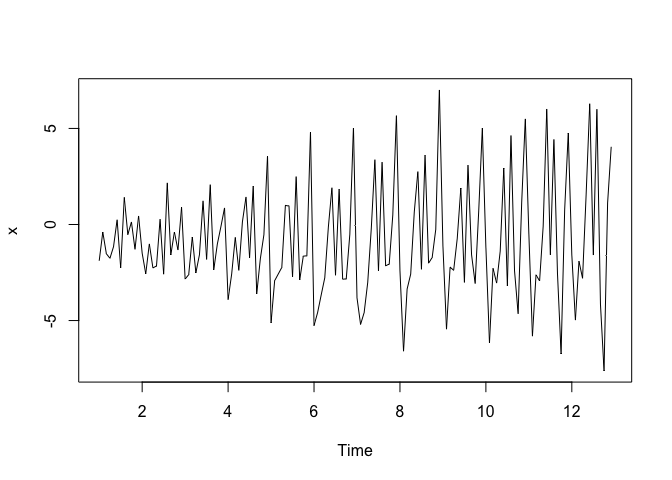<!-- -->

``` r
acf(x,lag.max = 36)
```

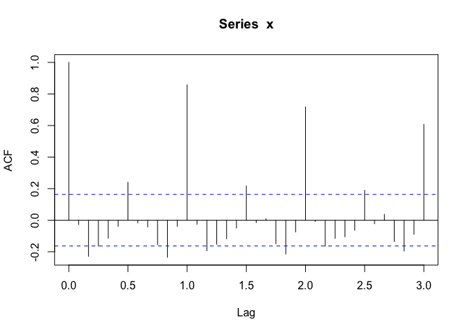<!-- -->

``` r
monthplot(x)
```

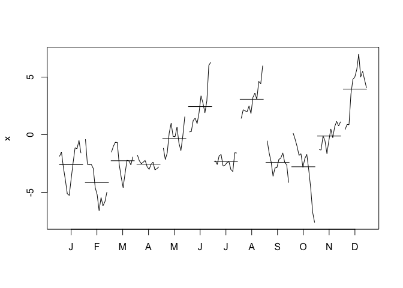<!-- -->

``` r
nsdiffs(x)####Decreta cuantas diferencias estacional a través de la aplicación de 
```

    ## [1] 1

``` r
###Algunas pruebas de raíces unitarias estacionales.


###diferencia estacional
Dx=diff(x,lag=12,differences = 1)###lag:periodo s.
plot(Dx)
```

<!-- -->

``` r
acf(Dx,lag.max = 36)
```

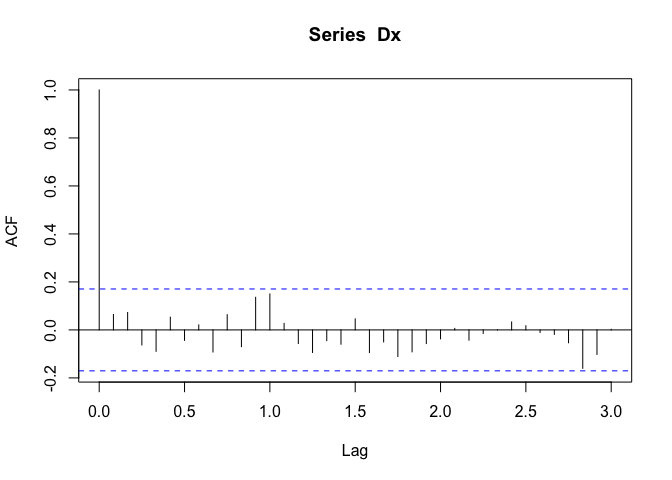<!-- -->

``` r
monthplot(Dx)
```

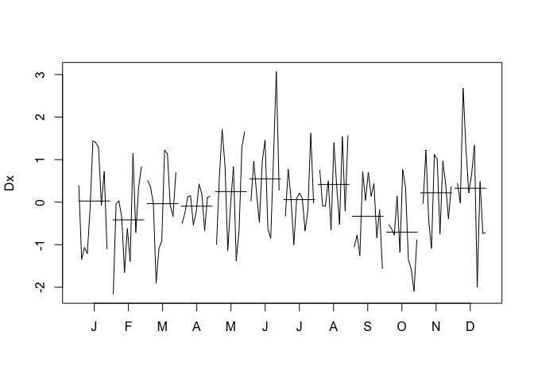<!-- -->

``` r
nsdiffs(Dx)
```

    ## [1] 0

``` r
####Simulación de un SAR
#x11()
x1 <- ts(sim_sarima(n=144, model = list(ar=c(rep(0,11),0.8)),n.start=24),frequency=12)
plot(x1)
```

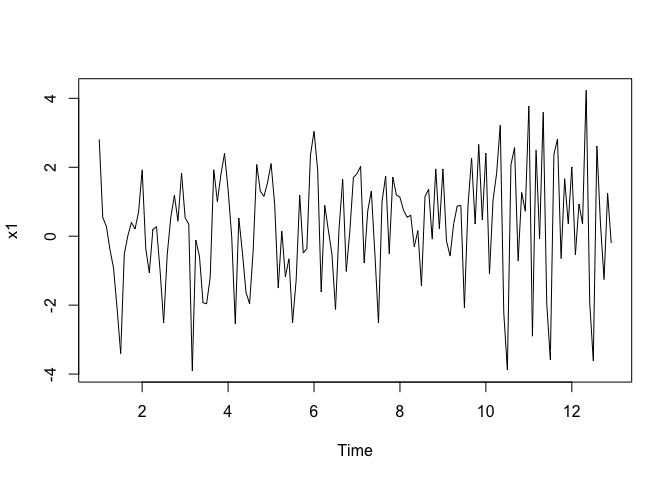<!-- -->

``` r
acf(x1,lag.max = 36)
```

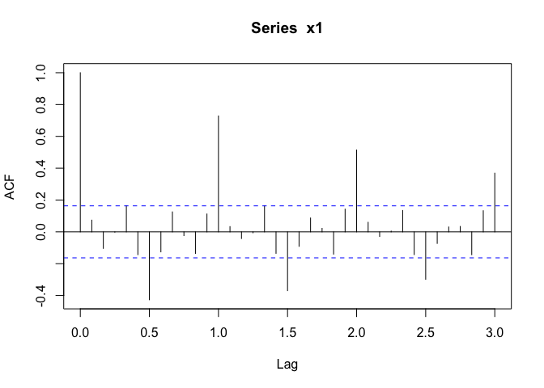<!-- -->

``` r
monthplot(x1)
```

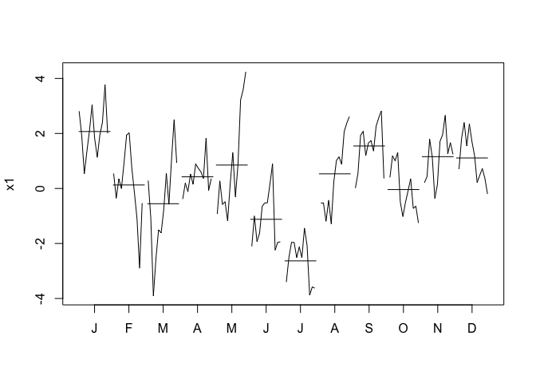<!-- -->

``` r
nsdiffs(x1)
```

    ## [1] 1

``` r
p <- polynom(c(1,c(rep(0,11),-0.8)))
solve(p)
```

    ##  [1] -1.0187693+0.0000000i -0.8822801-0.5093846i -0.8822801+0.5093846i
    ##  [4] -0.5093846-0.8822801i -0.5093846+0.8822801i  0.0000000-1.0187693i
    ##  [7]  0.0000000+1.0187693i  0.5093846-0.8822801i  0.5093846+0.8822801i
    ## [10]  0.8822801-0.5093846i  0.8822801+0.5093846i  1.0187693+0.0000000i

``` r
abs(solve(p))
```

    ##  [1] 1.018769 1.018769 1.018769 1.018769 1.018769 1.018769 1.018769 1.018769
    ##  [9] 1.018769 1.018769 1.018769 1.018769

``` r
###Note lo cerca que están la raíces de la no estacionariedad del proceso, por eso
####aunque si bien el proceso es estacionario, notamos hay una cercanía a 
####e tener una compoenete estacional.
####El anterior modelo puede escribirse como:
x2 <- ts(sim_sarima(n=144, model=list(sar=0.8, iorder=0, siorder=0, nseasons=12),n.start=24),frequency = 12)
plot(x2)
```

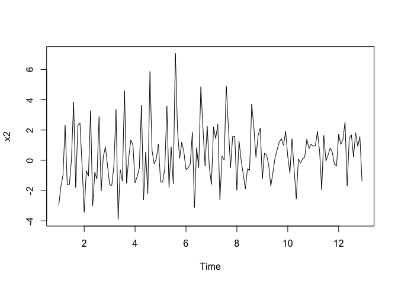<!-- -->

``` r
acf(x2, lag.max=48)
```

<!-- -->

``` r
monthplot(x2)
```

<!-- -->

``` r
nsdiffs(x2)
```

    ## [1] 1

Ejermplo Pasajeros
------------------

Vamos a ver como se hace el modelamiento completo de la serie de
pasajeros.

Iniciaremos con la transformación Box-Cox y las pruebas de raíces
Unitarias

<!-- -->

    ## 
    ##  Augmented Dickey-Fuller Test
    ## 
    ## data:  lAirpassengers
    ## Dickey-Fuller = -1.3232, Lag order = 10, p-value = 0.8582
    ## alternative hypothesis: stationary

    ## Warning in fUnitRoots::adfTest(lAirpassengers, lags = 12, type = "nc"): p-value
    ## greater than printed p-value

    ## 
    ## Title:
    ##  Augmented Dickey-Fuller Test
    ## 
    ## Test Results:
    ##   PARAMETER:
    ##     Lag Order: 12
    ##   STATISTIC:
    ##     Dickey-Fuller: 3.7872
    ##   P VALUE:
    ##     0.99 
    ## 
    ## Description:
    ##  Wed Nov 25 05:38:59 2020 by user:

    ## 
    ## ############################################### 
    ## # Augmented Dickey-Fuller Test Unit Root Test # 
    ## ############################################### 
    ## 
    ## Test regression none 
    ## 
    ## 
    ## Call:
    ## lm(formula = z.diff ~ z.lag.1 - 1 + z.diff.lag)
    ## 
    ## Residuals:
    ##       Min        1Q    Median        3Q       Max 
    ## -0.103864 -0.023652 -0.001455  0.022160  0.126649 
    ## 
    ## Coefficients:
    ##               Estimate Std. Error t value Pr(>|t|)    
    ## z.lag.1       0.005439   0.001436   3.787 0.000241 ***
    ## z.diff.lag1  -0.198813   0.072080  -2.758 0.006737 ** 
    ## z.diff.lag2  -0.273730   0.073309  -3.734 0.000292 ***
    ## z.diff.lag3  -0.233607   0.072258  -3.233 0.001589 ** 
    ## z.diff.lag4  -0.293133   0.073926  -3.965 0.000126 ***
    ## z.diff.lag5  -0.206562   0.072058  -2.867 0.004915 ** 
    ## z.diff.lag6  -0.266919   0.071493  -3.734 0.000292 ***
    ## z.diff.lag7  -0.234526   0.071847  -3.264 0.001436 ** 
    ## z.diff.lag8  -0.327393   0.073197  -4.473 1.79e-05 ***
    ## z.diff.lag9  -0.198455   0.073623  -2.696 0.008054 ** 
    ## z.diff.lag10 -0.279931   0.072710  -3.850 0.000192 ***
    ## z.diff.lag11 -0.176122   0.073011  -2.412 0.017394 *  
    ## z.diff.lag12  0.627402   0.072683   8.632 3.34e-14 ***
    ## ---
    ## Signif. codes:  0 '***' 0.001 '**' 0.01 '*' 0.05 '.' 0.1 ' ' 1
    ## 
    ## Residual standard error: 0.04308 on 118 degrees of freedom
    ## Multiple R-squared:  0.8564, Adjusted R-squared:  0.8406 
    ## F-statistic: 54.14 on 13 and 118 DF,  p-value: < 2.2e-16
    ## 
    ## 
    ## Value of test-statistic is: 3.7872 
    ## 
    ## Critical values for test statistics: 
    ##       1pct  5pct 10pct
    ## tau1 -2.58 -1.95 -1.62

    ## 
    ## Title:
    ##  Augmented Dickey-Fuller Test
    ## 
    ## Test Results:
    ##   PARAMETER:
    ##     Lag Order: 12
    ##   STATISTIC:
    ##     Dickey-Fuller: -1.5325
    ##   P VALUE:
    ##     0.7711 
    ## 
    ## Description:
    ##  Wed Nov 25 05:38:59 2020 by user:

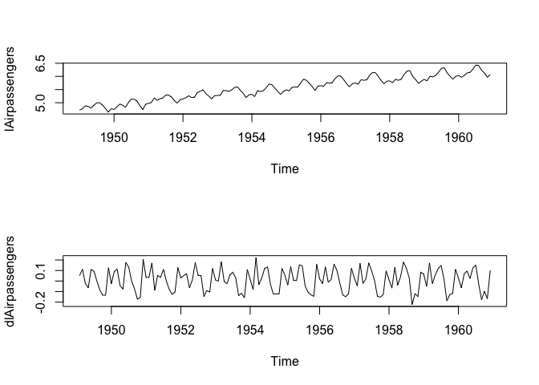<!-- -->

    ## Warning in adfTest(dlAirpassengers, lags = 2, type = "nc"): p-value smaller than
    ## printed p-value

    ## 
    ## Title:
    ##  Augmented Dickey-Fuller Test
    ## 
    ## Test Results:
    ##   PARAMETER:
    ##     Lag Order: 2
    ##   STATISTIC:
    ##     Dickey-Fuller: -7.6337
    ##   P VALUE:
    ##     0.01 
    ## 
    ## Description:
    ##  Wed Nov 25 05:38:59 2020 by user:

Identificación de la componente ARMA estacional y la componente ARMA ordinaria
------------------------------------------------------------------------------

``` r
####################################
######Diferencia Estacional(continuación AirPassengers)#######
monthplot(dlAirpassengers)
```

<!-- -->

``` r
nsdiffs(dlAirpassengers)
```

    ## [1] 1

``` r
nsdiffs(AirPassengers)
```

    ## [1] 1

``` r
DdlAirpassengers=diff(dlAirpassengers,lag=12)###lag=s
#x11()
par(mfrow=c(2,1))
plot(dlAirpassengers)
plot(DdlAirpassengers)
```

<!-- -->

``` r
monthplot(DdlAirpassengers)
nsdiffs(DdlAirpassengers)
```

    ## [1] 0

``` r
##Autocorrelogramas
#x11()
acf(DdlAirpassengers)
```

<!-- -->

``` r
acf(DdlAirpassengers,lag.max = 48, ci.type='ma')
pacf(DdlAirpassengers,lag.max = 48)
```

<!-- -->

Ajuste del Modelo y Análisis de Residuales
------------------------------------------

``` r
##Ajuste del modelo
###Arima Estacional o SARIMA(p=0,d=1,q=1)x(P=0,D=1,Q=1)s=12 con transformación logaritmica

#Modelo MA(1) estacional
modelo = Arima(AirPassengers, c(0, 1, 1),seasonal = list(order = c(0, 1, 1), period = 12),lambda = 0)
coeftest(modelo)
```

    ## 
    ## z test of coefficients:
    ## 
    ##       Estimate Std. Error z value  Pr(>|z|)    
    ## ma1  -0.401828   0.089644 -4.4825 7.378e-06 ***
    ## sma1 -0.556945   0.073100 -7.6190 2.557e-14 ***
    ## ---
    ## Signif. codes:  0 '***' 0.001 '**' 0.01 '*' 0.05 '.' 0.1 ' ' 1

``` r
modeloalter= Arima(AirPassengers, c(1, 1, 0),seasonal = list(order = c(1, 1, 0), period = 12),lambda = 0)

## Análisis de residuales
#x11()
residuales <- modelo$residuals
plot(residuales)
```

<!-- -->

``` r
acf(residuales)
```

<!-- -->

``` r
pacf(residuales)
```

<!-- -->

``` r
######Análisis de Outliers
#Test de normalidad
jarque.bera.test(residuales)
```

    ## 
    ##  Jarque Bera Test
    ## 
    ## data:  residuales
    ## X-squared = 5.2265, df = 2, p-value = 0.0733

``` r
#Test de autocorrelaci?n
Box.test(residuales, lag = (length(residuales)/4), type = "Ljung-Box", fitdf = 2)
```

    ## 
    ##  Box-Ljung test
    ## 
    ## data:  residuales
    ## X-squared = 37.874, df = 34, p-value = 0.2969

``` r
###Estad?ticas CUSUM
res=residuales
cum=cumsum(res)/sd(res)
N=length(res)
cumq=cumsum(res^2)/sum(res^2)
Af=0.948 ###Cuantil del 95% para la estad?stica cusum
co=0.14422####Valor del cuantil aproximado para cusumsq para n/2
LS=Af*sqrt(N)+2*Af*c(1:length(res))/sqrt(N)
LI=-LS
LQS=co+(1:length(res))/N
LQI=-co+(1:length(res))/N
par(mfrow=c(2,1))
plot(cum,type="l",ylim=c(min(LI),max(LS)),xlab="t",ylab="",main="CUSUM")
lines(LS,type="S",col="red")
lines(LI,type="S",col="red")
#CUSUM Square
plot(cumq,type="l",xlab="t",ylab="",main="CUSUMSQ")                      
lines(LQS,type="S",col="red")                                                                           
lines(LQI,type="S",col="red")
```

<!-- -->

Pronóstico
----------

``` r
#x11()
Pronosticos=forecast(modelo,h=12,level=0.95)
plot(Pronosticos)
```

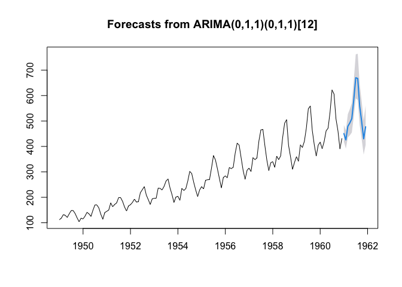<!-- -->

``` r
predic<-predict(modelo,n.ahead=12)
plot(predic$pred)
```

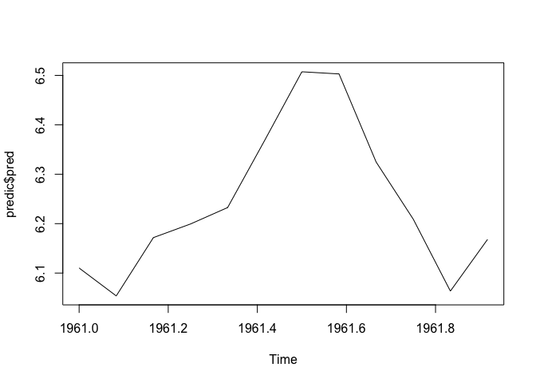<!-- -->

``` r
#####Comparación de pronósticos####
library(fpp)
```

    ## Loading required package: fma

    ## Loading required package: expsmooth

``` r
train <- window(AirPassengers,start=c(1949,01),end=c(1959,12))
test <- window(AirPassengers,start=c(1960,01),end=c(1960,12))
fitmodelo <- Arima(AirPassengers, c(0, 1, 1),seasonal = list(order = c(0, 1, 1), period = 12),lambda = 0)
refit <- Arima(AirPassengers, model=fitmodelo)
fc <- window(fitted(refit), start=c(1960,1))


h <- 1
train <- window(AirPassengers,start=c(1949,01),end=c(1959,12))
test <- window(AirPassengers,start=c(1960,01),end=c(1960,12))
n <- length(test) - h + 1
fitmodelo <- Arima(AirPassengers, c(0, 1, 1),seasonal = list(order = c(0, 1, 1), period = 12),lambda = 0)
fc <- ts(numeric(n), start=c(1960,01), freq=12)
for(i in 1:n)
{  
  x <- window(AirPassengers, end=c(1959, 12+(i-1)))
  refit <- Arima(x, model=fitmodelo)
  fc[i] <- forecast(refit, h=h)$mean[h]
}
dife=(test-fc)^2
ecm=(1/(length(test)))*sum(dife)
ecm
```

    ## [1] 342.0955
